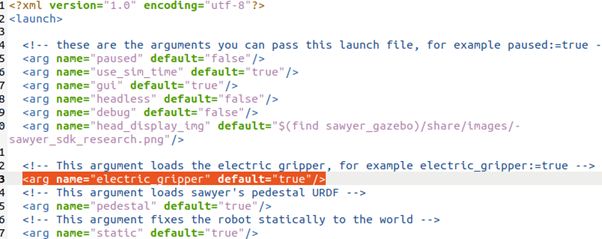
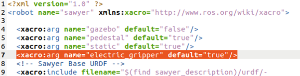

# Dissertation Code

This repository contains the code used for my dissertation project: Human Gestures Guide Robot Control.
The dataset used to train and evaluate the classification model is [HaGRID](https://github.com/hukenovs/hagrid) (Lightweight version with min side = 512px)
## Installation

- To install the necessary dependencies, run the following command:
```bash
pip install -r requirements.txt
```

- In the ROS device, run the following command:
```bash
sudo apt install ros-noetic-kdl-parser-py 
sudo apt install ros-noetic-eigenpy 
sudo apt install python3-pykdl
pip3 install urdf-parser-py
pip3 install eigenpy
```

- Set up the robot with the gripper:

Go to your workspace root and then `/src/sawyer_simulator/sawyer_gazebo/launch/sawyer_world.launch`,
change the value here to true:



Then go to  `/src/sawyer_robot/sawyer_description/urdf/sawyer.urdf.xacro` , change this value to true:



Make sure you have Python 3.x installed on your system.

## Usage

Before running the code, check your local ip address on the ROS-device and change the value `self.host` in the `get_directions_connect.py`.
Put the folder `sawyer_camera_controller` into the `src` folder in your root of ROS workspace.

Make sure you have entered the environment before running the code

In the client PC, run the following commands:
```bash
python get_directions_connect.py
```

In the ROS device, open at least 2 terminal windows, navigate to the root of your ROS workspace and run the following commands:
- In the first terminal: initialize the sawyer simulator (Ignore this if you are testing with the real robot)
```bash
./src/intera_sdk/intera.sh sim

roslaunch sawyer_gazebo sawyer_world.launch
```

- In the second terminal: running main file
```bash
./src/intera_sdk/intera.sh sim

rosrun sawyer_camera_controller arm_controller_pykdl.py
```